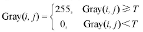

### 基于阈值的图像分割
阈值化处理可以将图像中的像素划分为两类颜色。当某个像素点的灰度`Gray(i,j)`小于阈值`T`时，
像素设置为0表示黑色;当灰度`Gray(i,j)`大于等于阈值`T`时，像素值为255，表示白色



### 边缘分割
图像中相邻区域之间的像素集合共同构成了图像的边缘。
基于边缘检测的图像分割方法是通过确定图像中的边缘轮廊像素，然后将这些像素连接起来构建区域边界的过程。
由于沿着图像边缘走向的像素值变化比较平缓，而沿着垂直于边缘走向的像素值变化比较大，所以通常会采用一阶导数和二阶导数来描述与检测边缘。

### findContours
OpenCV提供的findCoutours函数可以从二值图像中寻找轮廓
```angular2html
contours,hierarchy=findContours(image, mode, method[, contours[, hierarchy[, offset]]])
```
（1）image表示输入图像，即用于寻找轮廊的图像，为8位单通道。  

（2）mode表示轮廊检索模式。cv2.RETR_EXTERNAL表示只检测外轮廊；
cv2. RETR_LIST表示提取所有轮廊，且检测的轮廊不建立等级关系；
cv2.RETR_CCOMP提取 所有轮廊，并建立两个等级的轮廊，上面的一层为外边界，里面一层为内孔的边界信息；
cv2.RETR_TREE表示提取所有轮廊，并且建立一个等级树或网状结构的轮廊。   

（3）mehod表示轮廊的近似方法。cv2.CHAIN_APPROX_NONE存储所有的轮廊点，
相邻的两个点的像素位置差不超过1，即max（abs（x1-x2），abs（yl-y2））=l；
cv2.CHAIN_APPROXSIMPLE压缩水平方向、垂直方向、对角线方向的元素，只保留该方向的终点坐标，
例如，一个矩阵轮廊只需四个点来保存轮廊信息；
cv2.CHAIN_APPROX_TC89L1 和cv2.CHAIN_APPROX_TC89_KCOS使用Teh-ChinlChain近似算法。  

（4）contours表示检测到的轮廊，其函数运行后的结果存在该变量中，每个轮廊存储为一个点向量。  

（5）hierarchy表示输出变量，包含图像的拓扑信息，作为轮廊数量的表示，它包含了许多元素，
每个轮廊contours[i]对应四个hierarchy元素hierarehy[i][O]～hierarchy[i][3]，分
别表示后一个轮、前一个轮廊、父轮廊、内嵌轮廊的索引编号。   

（6）offset表示每个轮廓点的可选偏移量。   

在使用findContours（）函数检测图像边缘轮廊后，通常需要和drawContours（）函数联合使用，
接着绘制检测到的轮廊，drawContours（）函数的原型如下。

```angular2html
image = drawContours(image, contours, contourIdx, color[, thickness[, lineType[, hierarchy[, maxLevel[, offset]]]]])
```
（1）image表示目标图像，即所要绘制轮廊的背景图像。  

（2）contours表示所有的输入轮廊，每个轮廊存储为一个点向量。   

（3）contouldx表示轮廊绘制的指示变量，如果为负数表示绘制所有轮廊。  

（4）color表示绘制轮廊的颜色。  

（5）thickness表示绘制轮廊线条的粗细程度，默认值为1。  

（6）lineType表示线条类型，默认值为8，可选线包括8（8连通线型）、4（4连通线型）、CV_AA（抗锯齿线型）  

（7）hierarchy表示可选的层次结构信息。  

（8）maxLevel表示用于绘制轮廉的最大等级，默认值为INT_MAX。  

（9）offset表示每个轮廓点的可选偏移量。  

### 基于纹理背景的图像分割
GrabCut算法能够有效地利用纹理信息和边界信息分割背景，提取图像目标物体。
该算法是微软研究院基于图像分割和据图的课题，它能有效地将目标图像分割提取。
```angular2html
grabCut(img, mask, rect, bgdModel, fgdModel, iterCount[, mode]) -> mask, bgdModel, fgdModel
```
（1）img表示输入图像，为8位三通道图像。  

（2）mask表示蒙板图像，输入/输出的8位单通道拖码，确定前景区域、背景区域、不确定区域。
当模式设置为GC_INIT_WITH_RECT时，该掩码由函数初始化。   

（3）rect表示前景对象的矩形坐标，其基本格式为（x，y，w，h），分别为左上角坐标和宽度、高度。   

（4）bdgModel表示后台模型使用的数组，通常设置为大小为（1，65）np.float64的数组。  

（5）fgdModel表示前台模型使用的数组，通常设置为大小为（1，65）np.float64的数组。

（6）iterCout表示算法运行的送代次数。  

（7）mode是cv::GrabCutModes操作模式之一，c2.GC_INIT_WITH_RECT或cv2.GC_INIT_WITH_MASK表示使用矩阵模式或蒙板模式。
