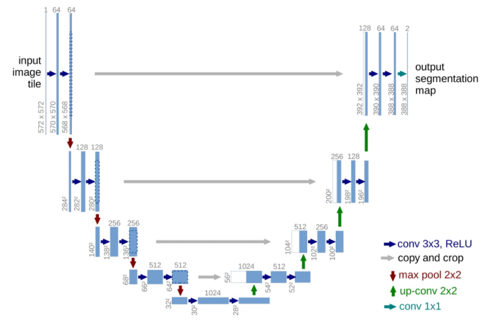
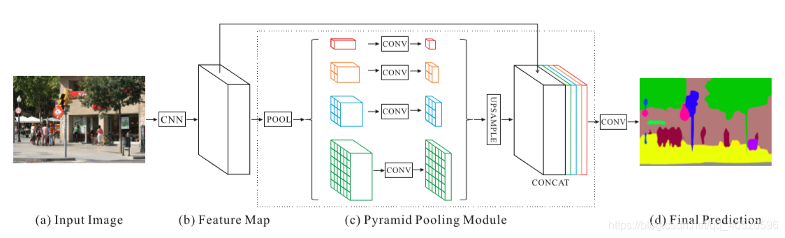
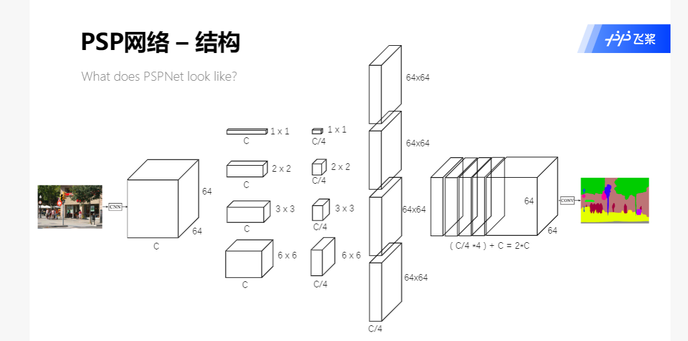
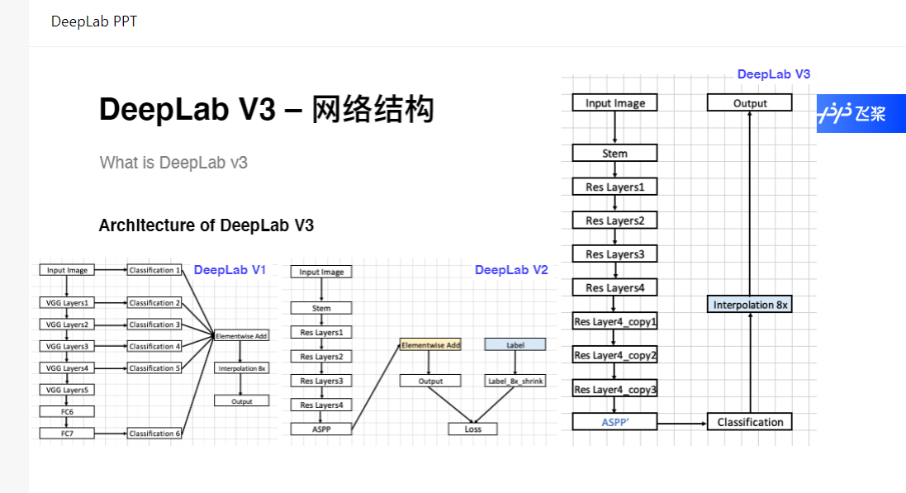

### 1、Unet
   

1:下采样Encode包括conv和max pool，上采样Decode包括up-conv和conv。  
2:U-Net特点在于灰色箭头，利用通道融合使上下文信息紧密联系起来。

### 2、PSPNET
  
结构形似金字塔而被命名，能够聚合不同尺度下的上下文信息，在场景解析上有很好的效果。PSPNet的精髓在于pyramid parsing module的构建，能够增大深层区域的感受野。

1:多尺度特征融合可以提高模型性能，深层网络中包含更多的语义信息和较小的位置信息。  
2:input image需要通过CNN网路提取特征，这里使用的是飞桨预训练的resnet50网络。  
3:PSPmodule将CNN的输出划成四个通道，然后进行上采样，全局特征和局部特征进行融合得到2C通道。

### 3、Deeplabv3
使用了空洞卷积  
